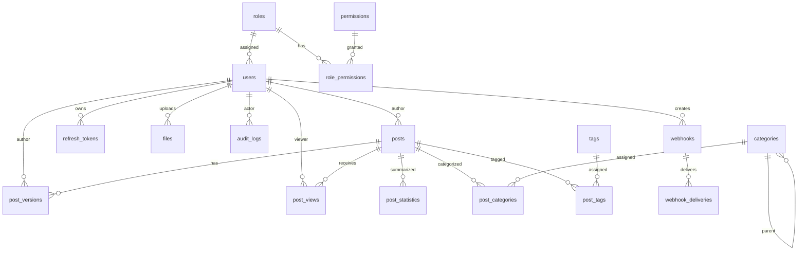

# Bloggo Database Architecture

## 📋 Table of Contents
- [Database Overview](#database-overview)
- [Schema Design](#schema-design)
- [Table Structures](#table-structures)
- [Relationships](#relationships)
- [Indexing Strategy](#indexing-strategy)
- [Data Management](#data-management)
- [Migration Strategy](#migration-strategy)
- [Performance Considerations](#performance-considerations)
- [Backup and Recovery](#backup-and-recovery)

## 🗄️ Database Overview

### Technology Choice: SQLite

Bloggo uses SQLite as its primary database, chosen for the following reasons:

**Advantages**:
- **Zero Configuration**: No separate database server required
- **Portability**: Single file database that can be easily moved
- **Performance**: Excellent read performance for blog-sized datasets
- **Reliability**: ACID compliant with robust transaction support
- **Maintenance**: Simple backup and restore procedures
- **Resource Efficiency**: Low memory and CPU requirements

**Trade-offs**:
- **Write Concurrency**: Limited concurrent write operations
- **Network Access**: No remote database access
- **Scale**: Not suitable for massive multi-server deployments
- **Advanced Features**: Limited compared to enterprise databases

### Database File Structure

```
bloggo/
├── bloggo.sqlite         # Main database file
├── bloggo.sqlite-wal     # Write-Ahead Log (during operation)
├── bloggo.sqlite-shm     # Shared Memory file (during operation)
└── backups/              # Database backups directory
    ├── daily/
    ├── weekly/
    └── monthly/
```

## 🏗️ Schema Design

### Design Principles

1. **Normalization**: Database follows 3NF (Third Normal Form) where practical
2. **Denormalization for Performance**: Read counts and statistics are denormalized
3. **Audit Trail**: All important tables have created_at/updated_at timestamps
4. **Soft Deletes**: Important data is soft-deleted rather than physically deleted
5. **Type Safety**: Appropriate data types and constraints are used

### Naming Conventions

- **Tables**: `snake_case` singular (e.g., `user`, `post`, `category`)
- **Columns**: `snake_case` descriptive names
- **Primary Keys**: `id` (auto-incrementing integer)
- **Foreign Keys**: `{table}_id` (e.g., `post_id`, `user_id`)
- **Timestamps**: `created_at`, `updated_at`
- **Boolean Columns**: `is_{condition}` (e.g., `is_published`)

## 📊 Table Structures

### 1. Users and Authentication

#### users
User account information and credentials.

```sql
CREATE TABLE users (
    id INTEGER PRIMARY KEY AUTOINCREMENT,
    name VARCHAR(255) NOT NULL,
    email VARCHAR(255) UNIQUE NOT NULL,
    passphrase_hash VARCHAR(255) NOT NULL,
    role_id INTEGER NOT NULL,
    avatar VARCHAR(255),
    created_at DATETIME DEFAULT CURRENT_TIMESTAMP,
    updated_at DATETIME DEFAULT CURRENT_TIMESTAMP,
    FOREIGN KEY (role_id) REFERENCES roles(id)
);
```

**Indexes**:
- `PRIMARY KEY (id)`
- `UNIQUE INDEX idx_users_email (email)`
- `INDEX idx_users_role_id (role_id)`

#### roles
User roles and permissions.

```sql
CREATE TABLE roles (
    id INTEGER PRIMARY KEY AUTOINCREMENT,
    name VARCHAR(100) UNIQUE NOT NULL,
    description TEXT,
    created_at DATETIME DEFAULT CURRENT_TIMESTAMP,
    updated_at DATETIME DEFAULT CURRENT_TIMESTAMP
);
```

**Default Roles**:
- `admin`: Full system access
- `editor`: Content management access
- `author`: Content creation access

#### permissions
System permissions that can be assigned to roles.

```sql
CREATE TABLE permissions (
    id INTEGER PRIMARY KEY AUTOINCREMENT,
    name VARCHAR(100) UNIQUE NOT NULL,
    description TEXT,
    created_at DATETIME DEFAULT CURRENT_TIMESTAMP
);
```

#### role_permissions
Many-to-many relationship between roles and permissions.

```sql
CREATE TABLE role_permissions (
    role_id INTEGER NOT NULL,
    permission_id INTEGER NOT NULL,
    PRIMARY KEY (role_id, permission_id),
    FOREIGN KEY (role_id) REFERENCES roles(id) ON DELETE CASCADE,
    FOREIGN KEY (permission_id) REFERENCES permissions(id) ON DELETE CASCADE
);
```

#### refresh_tokens
Refresh tokens for maintaining user sessions.

```sql
CREATE TABLE refresh_tokens (
    id INTEGER PRIMARY KEY AUTOINCREMENT,
    user_id INTEGER NOT NULL,
    token_hash VARCHAR(255) UNIQUE NOT NULL,
    expires_at DATETIME NOT NULL,
    is_revoked BOOLEAN DEFAULT FALSE,
    created_at DATETIME DEFAULT CURRENT_TIMESTAMP,
    FOREIGN KEY (user_id) REFERENCES users(id) ON DELETE CASCADE
);
```

**Indexes**:
- `PRIMARY KEY (id)`
- `UNIQUE INDEX idx_refresh_tokens_token_hash (token_hash)`
- `INDEX idx_refresh_tokens_user_id (user_id)`
- `INDEX idx_refresh_tokens_expires_at (expires_at)`

### 2. Content Management

#### posts
Main blog posts table.

```sql
CREATE TABLE posts (
    id INTEGER PRIMARY KEY AUTOINCREMENT,
    title VARCHAR(500) NOT NULL,
    slug VARCHAR(500) UNIQUE NOT NULL,
    content TEXT NOT NULL,
    excerpt TEXT,
    cover_image VARCHAR(255),
    author_id INTEGER NOT NULL,
    status VARCHAR(20) DEFAULT 'draft',
    published_at DATETIME,
    view_count INTEGER DEFAULT 0,
    read_time INTEGER DEFAULT 0,
    created_at DATETIME DEFAULT CURRENT_TIMESTAMP,
    updated_at DATETIME DEFAULT CURRENT_TIMESTAMP,
    FOREIGN KEY (author_id) REFERENCES users(id)
);
```

**Status Values**:
- `draft`: Unpublished draft
- `pending`: Pending approval
- `published`: Published post
- `archived`: Archived post

**Indexes**:
- `PRIMARY KEY (id)`
- `UNIQUE INDEX idx_posts_slug (slug)`
- `INDEX idx_posts_author_id (author_id)`
- `INDEX idx_posts_status (status)`
- `INDEX idx_posts_published_at (published_at)`
- `INDEX idx_posts_view_count (view_count)`

#### post_versions
Version control for posts with approval workflow.

```sql
CREATE TABLE post_versions (
    id INTEGER PRIMARY KEY AUTOINCREMENT,
    post_id INTEGER NOT NULL,
    version INTEGER NOT NULL,
    title VARCHAR(500) NOT NULL,
    content TEXT NOT NULL,
    excerpt TEXT,
    cover_image VARCHAR(255),
    status VARCHAR(20) DEFAULT 'draft',
    author_id INTEGER NOT NULL,
    approved_by INTEGER,
    approved_at DATETIME,
    created_at DATETIME DEFAULT CURRENT_TIMESTAMP,
    FOREIGN KEY (post_id) REFERENCES posts(id) ON DELETE CASCADE,
    FOREIGN KEY (author_id) REFERENCES users(id),
    FOREIGN KEY (approved_by) REFERENCES users(id),
    UNIQUE (post_id, version)
);
```

**Version Status Values**:
- `draft`: Draft version
- `pending`: Pending approval
- `approved`: Approved version
- `rejected`: Rejected version

#### categories
Post categories with hierarchical support.

```sql
CREATE TABLE categories (
    id INTEGER PRIMARY KEY AUTOINCREMENT,
    name VARCHAR(255) NOT NULL,
    slug VARCHAR(255) UNIQUE NOT NULL,
    description TEXT,
    parent_id INTEGER,
    created_at DATETIME DEFAULT CURRENT_TIMESTAMP,
    updated_at DATETIME DEFAULT CURRENT_TIMESTAMP,
    FOREIGN KEY (parent_id) REFERENCES categories(id)
);
```

**Indexes**:
- `PRIMARY KEY (id)`
- `UNIQUE INDEX idx_categories_slug (slug)`
- `INDEX idx_categories_parent_id (parent_id)`

#### tags
Post tags for metadata and organization.

```sql
CREATE TABLE tags (
    id INTEGER PRIMARY KEY AUTOINCREMENT,
    name VARCHAR(100) NOT NULL,
    slug VARCHAR(100) UNIQUE NOT NULL,
    created_at DATETIME DEFAULT CURRENT_TIMESTAMP
);
```

**Indexes**:
- `PRIMARY KEY (id)`
- `UNIQUE INDEX idx_tags_slug (slug)`

#### post_categories
Many-to-many relationship between posts and categories.

```sql
CREATE TABLE post_categories (
    post_id INTEGER NOT NULL,
    category_id INTEGER NOT NULL,
    PRIMARY KEY (post_id, category_id),
    FOREIGN KEY (post_id) REFERENCES posts(id) ON DELETE CASCADE,
    FOREIGN KEY (category_id) REFERENCES categories(id) ON DELETE CASCADE
);
```

#### post_tags
Many-to-many relationship between posts and tags.

```sql
CREATE TABLE post_tags (
    post_id INTEGER NOT NULL,
    tag_id INTEGER NOT NULL,
    PRIMARY KEY (post_id, tag_id),
    FOREIGN KEY (post_id) REFERENCES posts(id) ON DELETE CASCADE,
    FOREIGN KEY (tag_id) REFERENCES tags(id) ON DELETE CASCADE
);
```

### 3. Analytics and Statistics

#### post_views
Detailed view tracking for analytics.

```sql
CREATE TABLE post_views (
    id INTEGER PRIMARY KEY AUTOINCREMENT,
    post_id INTEGER NOT NULL,
    user_id INTEGER,
    ip_address VARCHAR(45) NOT NULL,
    user_agent TEXT,
    referrer TEXT,
    viewed_at DATETIME DEFAULT CURRENT_TIMESTAMP,
    FOREIGN KEY (post_id) REFERENCES posts(id) ON DELETE CASCADE,
    FOREIGN KEY (user_id) REFERENCES users(id) ON DELETE SET NULL
);
```

**Indexes**:
- `PRIMARY KEY (id)`
- `INDEX idx_post_views_post_id (post_id)`
- `INDEX idx_post_views_user_id (user_id)`
- `INDEX idx_post_views_viewed_at (viewed_at)`
- `INDEX idx_post_views_ip_address (ip_address)`

#### post_statistics
Aggregated statistics for performance (denormalized data).

```sql
CREATE TABLE post_statistics (
    post_id INTEGER PRIMARY KEY,
    view_count INTEGER DEFAULT 0,
    read_time INTEGER DEFAULT 0,
    desktop_views INTEGER DEFAULT 0,
    mobile_views INTEGER DEFAULT 0,
    tablet_views INTEGER DEFAULT 0,
    last_viewed_at DATETIME,
    updated_at DATETIME DEFAULT CURRENT_TIMESTAMP,
    FOREIGN KEY (post_id) REFERENCES posts(id) ON DELETE CASCADE
);
```

**Indexes**:
- `PRIMARY KEY (post_id)`
- `INDEX idx_post_statistics_view_count (view_count)`
- `INDEX idx_post_statistics_last_viewed_at (last_viewed_at)`

### 4. File Management

#### files
Uploaded files and media management.

```sql
CREATE TABLE files (
    id INTEGER PRIMARY KEY AUTOINCREMENT,
    filename VARCHAR(255) NOT NULL,
    original_name VARCHAR(255) NOT NULL,
    file_path VARCHAR(500) NOT NULL,
    file_size INTEGER NOT NULL,
    mime_type VARCHAR(100) NOT NULL,
    uploaded_by INTEGER NOT NULL,
    is_public BOOLEAN DEFAULT TRUE,
    created_at DATETIME DEFAULT CURRENT_TIMESTAMP,
    FOREIGN KEY (uploaded_by) REFERENCES users(id)
);
```

**Indexes**:
- `PRIMARY KEY (id)`
- `INDEX idx_files_uploaded_by (uploaded_by)`
- `INDEX idx_files_mime_type (mime_type)`

### 5. Audit and Logging

#### audit_logs
Comprehensive audit trail for system activities.

```sql
CREATE TABLE audit_logs (
    id INTEGER PRIMARY KEY AUTOINCREMENT,
    user_id INTEGER,
    action VARCHAR(100) NOT NULL,
    resource_type VARCHAR(50) NOT NULL,
    resource_id INTEGER,
    old_values TEXT,
    new_values TEXT,
    ip_address VARCHAR(45),
    user_agent TEXT,
    created_at DATETIME DEFAULT CURRENT_TIMESTAMP,
    FOREIGN KEY (user_id) REFERENCES users(id) ON DELETE SET NULL
);
```

**Indexes**:
- `PRIMARY KEY (id)`
- `INDEX idx_audit_logs_user_id (user_id)`
- `INDEX idx_audit_logs_action (action)`
- `INDEX idx_audit_logs_resource_type (resource_type)`
- `INDEX idx_audit_logs_created_at (created_at)`

### 6. System Management

#### key_value_store
Simple key-value storage for configuration and caching.

```sql
CREATE TABLE key_value_store (
    key VARCHAR(255) PRIMARY KEY,
    value TEXT NOT NULL,
    expires_at DATETIME,
    created_at DATETIME DEFAULT CURRENT_TIMESTAMP,
    updated_at DATETIME DEFAULT CURRENT_TIMESTAMP
);
```

**Indexes**:
- `PRIMARY KEY (key)`
- `INDEX idx_key_value_store_expires_at (expires_at)`

#### webhooks
Webhook configurations for external integrations.

```sql
CREATE TABLE webhooks (
    id INTEGER PRIMARY KEY AUTOINCREMENT,
    name VARCHAR(255) NOT NULL,
    url VARCHAR(500) NOT NULL,
    events TEXT NOT NULL,
    secret_key VARCHAR(255),
    is_active BOOLEAN DEFAULT TRUE,
    created_by INTEGER NOT NULL,
    created_at DATETIME DEFAULT CURRENT_TIMESTAMP,
    updated_at DATETIME DEFAULT CURRENT_TIMESTAMP,
    FOREIGN KEY (created_by) REFERENCES users(id)
);
```

#### webhook_deliveries
Webhook delivery tracking and retry information.

```sql
CREATE TABLE webhook_deliveries (
    id INTEGER PRIMARY KEY AUTOINCREMENT,
    webhook_id INTEGER NOT NULL,
    event_type VARCHAR(100) NOT NULL,
    payload TEXT NOT NULL,
    response_code INTEGER,
    response_body TEXT,
    delivery_status VARCHAR(20) DEFAULT 'pending',
    attempt_count INTEGER DEFAULT 0,
    next_attempt_at DATETIME,
    delivered_at DATETIME,
    created_at DATETIME DEFAULT CURRENT_TIMESTAMP,
    FOREIGN KEY (webhook_id) REFERENCES webhooks(id) ON DELETE CASCADE
);
```

**Indexes**:
- `PRIMARY KEY (id)`
- `INDEX idx_webhook_deliveries_webhook_id (webhook_id)`
- `INDEX idx_webhook_deliveries_status (delivery_status)`
- `INDEX idx_webhook_deliveries_next_attempt (next_attempt_at)`

## 🔗 Relationships

### Entity Relationship Diagram



### Relationship Types

1. **One-to-One**: `posts` ↔ `post_statistics`
2. **One-to-Many**: `users` → `posts`, `categories` → `posts`
3. **Many-to-Many**: `posts` ↔ `categories`, `posts` ↔ `tags`
4. **Hierarchical**: `categories` (self-referencing)

### Referential Integrity

- **CASCADE DELETE**: Used for dependent data (post_versions, post_categories, etc.)
- **SET NULL**: Used for optional references (user_id in audit_logs)
- **RESTRICT**: Used for critical references that shouldn't be deleted

## 🎯 Indexing Strategy

### Primary Indexes

All tables have auto-incrementing integer primary keys for optimal performance.

### Unique Indexes

- `users.email`: Ensures unique email addresses
- `posts.slug`: Ensures unique post URLs
- `categories.slug`: Ensures unique category URLs
- `tags.slug`: Ensures unique tag URLs

### Foreign Key Indexes

All foreign key columns are indexed for optimal join performance.

### Query Optimization Indexes

#### Performance-Critical Queries

1. **Post Listing**:
```sql
-- Index for published posts ordered by date
CREATE INDEX idx_posts_published_status ON posts(status, published_at DESC);
```

2. **User Authentication**:
```sql
-- Index for email-based login
CREATE INDEX idx_users_email_lookup ON users(email);
```

3. **Post Views Analytics**:
```sql
-- Index for view statistics
CREATE INDEX idx_post_views_analytics ON post_views(post_id, viewed_at DESC);
```

4. **Category Navigation**:
```sql
-- Index for category-based browsing
CREATE INDEX idx_post_categories_category ON post_categories(category_id);
```

### Composite Indexes

```sql
-- For user's draft posts
CREATE INDEX idx_user_drafts ON posts(author_id, status, updated_at DESC);

-- For recent views
CREATE INDEX idx_recent_views ON post_views(viewed_at DESC, post_id);

-- For audit log queries
CREATE INDEX idx_audit_logs_user_action ON audit_logs(user_id, created_at DESC);
```

## 📈 Data Management

### Data Seeding

Default data is automatically seeded when the database is created:

#### Default Roles
```sql
INSERT INTO roles (name, description) VALUES
('admin', 'Full system administration access'),
('editor', 'Can edit and publish all content'),
('author', 'Can create and edit own content');
```

#### Default Permissions
```sql
INSERT INTO permissions (name, description) VALUES
('posts.create', 'Create new posts'),
('posts.edit', 'Edit posts'),
('posts.publish', 'Publish posts'),
('posts.delete', 'Delete posts'),
('users.manage', 'Manage user accounts'),
('categories.manage', 'Manage categories'),
('tags.manage', 'Manage tags'),
('analytics.view', 'View analytics'),
('system.admin', 'System administration');
```

#### Role Permissions Assignment
```sql
-- Admin permissions (all permissions)
INSERT INTO role_permissions (role_id, permission_id)
SELECT 1, id FROM permissions;

-- Editor permissions
INSERT INTO role_permissions (role_id, permission_id)
SELECT 2, id FROM permissions
WHERE name IN ('posts.create', 'posts.edit', 'posts.publish', 'categories.manage', 'tags.manage', 'analytics.view');

-- Author permissions
INSERT INTO role_permissions (role_id, permission_id)
SELECT 3, id FROM permissions
WHERE name IN ('posts.create', 'posts.edit');
```

#### Default Admin User
```sql
INSERT INTO users (name, email, passphrase_hash, role_id) VALUES
('Administrator', 'admin@bloggo.local', '$2a$10$hashedpassword', 1);
```

### Data Validation

#### Database-Level Constraints
```sql
-- Example constraints
ALTER TABLE posts ADD CONSTRAINT chk_post_status
CHECK (status IN ('draft', 'pending', 'published', 'archived'));

ALTER TABLE users ADD CONSTRAINT chk_user_email
CHECK (email LIKE '%@%.%');

ALTER TABLE posts ADD CONSTRAINT chk_post_read_time
CHECK (read_time >= 0);
```

#### Application-Level Validation
- Input validation before database operations
- Business logic validation in service layer
- Comprehensive error handling

### Soft Deletes

For important data, soft deletes are implemented:

```sql
-- Example: Soft delete for posts
ALTER TABLE posts ADD COLUMN deleted_at DATETIME;

-- Query to exclude deleted posts
SELECT * FROM posts WHERE deleted_at IS NULL;
```

## 🔄 Migration Strategy

### Version Control

Database schema changes are versioned using migration files:

```
internal/db/migrations/
├── 001_initial_schema.sql
├── 002_add_post_statistics.sql
├── 003_add_audit_logs.sql
├── 004_add_webhooks.sql
└── 005_add_post_versions.sql
```

### Migration Process

1. **Development**: Create migration file with changes
2. **Testing**: Apply migration to test database
3. **Review**: Code review of migration changes
4. **Deployment**: Apply migration to production
5. **Verification**: Verify successful migration

### Rollback Strategy

Each migration includes rollback script:

```sql
-- Migration file: 002_add_post_statistics.sql
-- Up migration
CREATE TABLE post_statistics (...);

-- Down migration
DROP TABLE post_statistics;
```

### Migration Automation

```go
type Migration struct {
    Version     int
    Description string
    Up          func(*sql.DB) error
    Down        func(*sql.DB) error
}

func RunMigrations(db *sql.DB) error {
    currentVersion := getCurrentVersion(db)
    for _, migration := range migrations {
        if migration.Version > currentVersion {
            if err := migration.Up(db); err != nil {
                return fmt.Errorf("migration %d failed: %w", migration.Version, err)
            }
        }
    }
    return nil
}
```

## ⚡ Performance Considerations

### Query Optimization

#### 1. Prepared Statements
All database queries use prepared statements for security and performance:

```go
stmt, err := db.Prepare(`
    INSERT INTO posts (title, slug, content, author_id)
    VALUES (?, ?, ?, ?)
`)
```

#### 2. Connection Management
- Single connection with proper lifecycle management
- Connection pooling consideration for future scaling
- Proper connection cleanup

#### 3. Query Analysis
Regular query performance analysis:

```sql
-- Enable query analysis
PRAGMA optimize;

-- Check query plan
EXPLAIN QUERY PLAN
SELECT p.*, u.name as author_name
FROM posts p
JOIN users u ON p.author_id = u.id
WHERE p.status = 'published'
ORDER BY p.published_at DESC
LIMIT 10;
```

### Database Configuration

#### SQLite Settings
```sql
-- Performance optimizations
PRAGMA journal_mode = WAL;        -- Write-Ahead Logging
PRAGMA synchronous = NORMAL;       -- Balance between safety and performance
PRAGMA cache_size = -10000;        -- 10MB cache
PRAGMA temp_store = MEMORY;        -- Store temporary tables in memory
PRAGMA mmap_size = 268435456;      -- 256MB memory-mapped I/O
```

#### Vacuum and Analyze
```sql
-- Rebuild database file
VACUUM;

-- Update query optimizer statistics
ANALYZE;
```

### Monitoring

#### Performance Metrics
- Query execution times
- Database file size
- Cache hit rates
- Connection utilization

#### Health Checks
```go
func CheckDatabaseHealth(db *sql.DB) error {
    // Check connection
    if err := db.Ping(); err != nil {
        return err
    }

    // Check if database is writable
    var result int
    err := db.QueryRow("SELECT 1").Scan(&result)
    return err
}
```

## 💾 Backup and Recovery

### Backup Strategy

#### 1. Automated Backups
```bash
#!/bin/bash
# Daily backup script
DATE=$(date +%Y%m%d_%H%M%S)
cp bloggo.sqlite "backups/daily/bloggo_$DATE.sqlite"
find backups/daily/ -name "bloggo_*.sqlite" -mtime +7 -delete
```

#### 2. Backup Types
- **Full Backups**: Complete database file copy
- **Incremental**: WAL file backups
- **Snapshot**: Point-in-time snapshots

#### 3. Backup Retention
- **Daily backups**: 7 days
- **Weekly backups**: 4 weeks
- **Monthly backups**: 12 months

### Recovery Procedures

#### 1. Point-in-Time Recovery
```bash
# Restore from backup
cp backups/daily/bloggo_20231004_120000.sqlite bloggo.sqlite

# Apply WAL logs if available
sqlite3 bloggo.sqlite ".recover"
```

#### 2. Disaster Recovery
1. Identify last known good backup
2. Restore database file
3. Verify data integrity
4. Update application configuration
5. Resume operations

#### 3. Data Integrity Checks
```sql
-- Check database integrity
PRAGMA integrity_check;

-- Check foreign key constraints
PRAGMA foreign_key_check;

-- Verify schema
.schema
```

### High Availability

#### 1. Database Replication
Future consideration for read replicas:

```bash
# WAL-based replication
sqlite3 bloggo.sqlite "PRAGMA wal_checkpoint(TRUNCATE);"
rsync -av bloggo.sqlite-wal replica:/path/to/replica/
```

#### 2. Failover Procedures
1. Monitor database health
2. Automated failover triggers
3. Manual failover procedures
4. Recovery time objectives (RTO)
5. Recovery point objectives (RPO)

---

**Document Version**: 1.0.0
**Last Updated**: October 4, 2025
**Author**: Bloggo Development Team
**Reviewers**: Database Architecture Committee