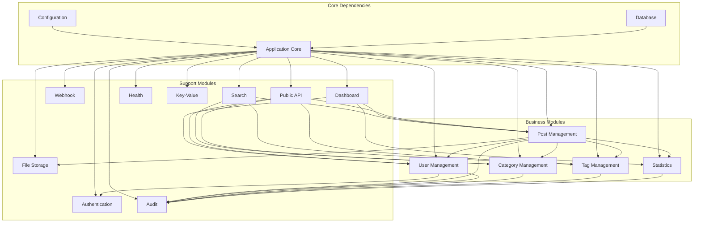

# Bloggo Module Architecture

## 📋 Table of Contents
- [Module Overview](#module-overview)
- [Core Modules](#core-modules)
- [Business Modules](#business-modules)
- [Support Modules](#support-modules)
- [Module Communication](#module-communication)
- [Module Lifecycle](#module-lifecycle)
- [Module Dependencies](#module-dependencies)
- [Extending the System](#extending-the-system)

## 🎯 Module Overview

Bloggo follows a modular architecture where each functional area is implemented as an independent module. This approach provides:

- **Separation of Concerns**: Each module handles a specific domain
- **Independent Development**: Teams can work on modules independently
- **Testing Isolation**: Modules can be tested in isolation
- **Flexible Deployment**: Modules can be enabled/disabled as needed

### Module Structure Pattern

```go
type Module interface {
    RegisterModule(router *chi.Mux)
}
```

Each module implements the `Module` interface and follows this structure:

```
internal/module/{module_name}/
├── {module_name}.go         # Module definition and registration
├── handler.go               # HTTP handlers
├── service.go               # Business logic
├── repository.go            # Data access layer
├── models.go                # Data models
├── validators.go            # Input validation
└── {module_name}_test.go    # Tests
```

## 🔧 Core Modules

### 1. Application Core (`internal/app/`)

**Purpose**: Central application bootstrap and lifecycle management

**Responsibilities**:
- Application initialization
- Router configuration
- Module registration
- Global middleware setup

**Key Components**:
```go
type Application struct {
    Router *chi.Mux
}

// Methods
func Get() *Application
func (app *Application) RegisterModules(modules []module.Module)
func (app *Application) RegisterGlobalMiddlewares(middlewares []func(http.Handler) http.Handler)
func (app *Application) Bootstrap()
```

**Dependencies**:
- All business modules (for registration)
- Configuration module
- Database connection

### 2. Configuration Module (`internal/config/`)

**Purpose**: Centralized configuration management

**Responsibilities**:
- Configuration file loading
- Environment variable handling
- Configuration validation
- Default value generation

**Key Components**:
```go
type Config struct {
    Port                 int    `json:"port" validate:"required,port"`
    JWTSecret            string `json:"JWTSecret" validate:"required,min=32,max=32"`
    AccessTokenDuration  int    `json:"accessTokenDuration" validate:"required"`
    RefreshTokenDuration int    `json:"refreshTokenDuration" validate:"required"`
    GeminiAPIKey         string `json:"geminiApiKey"`
    TrustedFrontendKey   string `json:"trustedFrontendKey" validate:"required,min=32,max=32"`
}

// Methods
func Get() Config
func IsGeminiEnabled() bool
func (conf Config) Save(file string)
```

**Configuration Sources** (priority order):
1. Environment variables
2. Configuration file (`bloggo-config.json`)
3. Default values

### 3. Database Module (`internal/db/`)

**Purpose**: Database connection and schema management

**Responsibilities**:
- Database connection management
- Schema initialization
- Data seeding
- Query organization

**Key Components**:
```go
// Connection management
func Get() *sql.DB

// Schema management
func InitializeTables(database *sql.DB)

// Data seeding
func SeedDatabase(database *sql.DB)
```

**Database Schema**:
- Users and authentication
- Posts and versions
- Categories and tags
- Statistics and analytics
- Permissions and roles

## 🏢 Business Modules

### 1. User Management (`internal/module/user/`)

**Purpose**: User account management and authentication

**Responsibilities**:
- User registration and login
- Profile management
- Password management
- User role assignment

**Key Models**:
```go
type User struct {
    ID             int64     `json:"id" db:"id"`
    Name           string    `json:"name" db:"name"`
    Email          string    `json:"email" db:"email"`
    PassphraseHash string    `json:"-" db:"passphrase_hash"`
    RoleID         int64     `json:"roleId" db:"role_id"`
    Avatar         *string   `json:"avatar" db:"avatar"`
    CreatedAt      time.Time `json:"createdAt" db:"created_at"`
    UpdatedAt      time.Time `json:"updatedAt" db:"updated_at"`
}

type Role struct {
    ID          int64  `json:"id" db:"id"`
    Name        string `json:"name" db:"name"`
    Description string `json:"description" db:"description"`
}
```

**API Endpoints**:
- `POST /api/users/register` - User registration
- `POST /api/users/login` - User login
- `GET /api/users/profile` - Get user profile
- `PUT /api/users/profile` - Update user profile
- `GET /api/users` - List users (admin only)
- `POST /api/users/{id}/role` - Assign role (admin only)

### 2. Post Management (`internal/module/post/`)

**Purpose**: Blog post creation, editing, and management

**Responsibilities**:
- Post creation and editing
- Version control and approval workflow
- Post publishing and scheduling
- Content validation

**Key Models**:
```go
type Post struct {
    ID          int64      `json:"id" db:"id"`
    Title       string     `json:"title" db:"title"`
    Slug        string     `json:"slug" db:"slug"`
    Content     string     `json:"content" db:"content"`
    Excerpt     *string    `json:"excerpt" db:"excerpt"`
    CoverImage  *string    `json:"coverImage" db:"cover_image"`
    AuthorID    int64      `json:"authorId" db:"author_id"`
    Status      PostStatus `json:"status" db:"status"`
    PublishedAt *time.Time `json:"publishedAt" db:"published_at"`
    CreatedAt   time.Time  `json:"createdAt" db:"created_at"`
    UpdatedAt   time.Time  `json:"updatedAt" db:"updated_at"`
}

type PostVersion struct {
    ID        int64           `json:"id" db:"id"`
    PostID    int64           `json:"postId" db:"post_id"`
    Version   int             `json:"version" db:"version"`
    Title     string          `json:"title" db:"title"`
    Content   string          `json:"content" db:"content"`
    Excerpt   *string         `json:"excerpt" db:"excerpt"`
    CoverImage *string        `json:"coverImage" db:"cover_image"`
    Status    VersionStatus   `json:"status" db:"status"`
    AuthorID  int64           `json:"authorId" db:"author_id"`
    CreatedAt time.Time       `json:"createdAt" db:"created_at"`
}
```

**API Endpoints**:
- `GET /api/posts` - List posts
- `GET /api/posts/{id}` - Get post details
- `POST /api/posts` - Create post
- `PUT /api/posts/{id}` - Update post
- `DELETE /api/posts/{id}` - Delete post
- `POST /api/posts/{id}/versions` - Create new version
- `PUT /api/posts/{id}/versions/{version}/approve` - Approve version

### 3. Category Management (`internal/module/category/`)

**Purpose**: Post categorization and organization

**Responsibilities**:
- Category creation and management
- Post-category relationship management
- Category hierarchy support

**Key Models**:
```go
type Category struct {
    ID          int64     `json:"id" db:"id"`
    Name        string    `json:"name" db:"name"`
    Slug        string    `json:"slug" db:"slug"`
    Description *string   `json:"description" db:"description"`
    ParentID    *int64    `json:"parentId" db:"parent_id"`
    CreatedAt   time.Time `json:"createdAt" db:"created_at"`
    UpdatedAt   time.Time `json:"updatedAt" db:"updated_at"`
}
```

**API Endpoints**:
- `GET /api/categories` - List categories
- `GET /api/categories/{id}` - Get category details
- `POST /api/categories` - Create category
- `PUT /api/categories/{id}` - Update category
- `DELETE /api/categories/{id}` - Delete category

### 4. Tag Management (`internal/module/tag/`)

**Purpose**: Post tagging and metadata management

**Responsibilities**:
- Tag creation and management
- Post-tag relationship management
- Tag-based content discovery

**Key Models**:
```go
type Tag struct {
    ID        int64  `json:"id" db:"id"`
    Name      string `json:"name" db:"name"`
    Slug      string `json:"slug" db:"slug"`
    CreatedAt time.Time `json:"createdAt" db:"created_at"`
}
```

**API Endpoints**:
- `GET /api/tags` - List tags
- `GET /api/tags/{id}` - Get tag details
- `POST /api/tags` - Create tag
- `PUT /api/tags/{id}` - Update tag
- `DELETE /api/tags/{id}` - Delete tag

### 5. Statistics Module (`internal/module/statistics/`)

**Purpose**: Analytics and statistics tracking

**Responsibilities**:
- View tracking and analytics
- User agent analysis
- Device and OS detection
- Read time calculation

**Key Models**:
```go
type PostView struct {
    ID          int64     `json:"id" db:"id"`
    PostID      int64     `json:"postId" db:"post_id"`
    UserID      *int64    `json:"userId" db:"user_id"`
    IPAddress   string    `json:"ipAddress" db:"ip_address"`
    UserAgent   string    `json:"userAgent" db:"user_agent"`
    ViewedAt    time.Time `json:"viewedAt" db:"viewed_at"`
}

type PostStatistics struct {
    PostID       int64   `json:"postId" db:"post_id"`
    ViewCount    int64   `json:"viewCount" db:"view_count"`
    ReadTime     int     `json:"readTime" db:"read_time"`
    DesktopViews int64   `json:"desktopViews" db:"desktop_views"`
    MobileViews  int64   `json:"mobileViews" db:"mobile_views"`
}
```

**API Endpoints**:
- `GET /api/statistics/posts/{id}` - Get post statistics
- `GET /api/statistics/overview` - Get overview statistics
- `POST /api/statistics/posts/{id}/view` - Track post view

## 🛠️ Support Modules

### 1. Authentication Module (`internal/module/session/`)

**Purpose**: Authentication token management

**Responsibilities**:
- JWT token generation and validation
- Refresh token management
- Session lifecycle management

**Key Features**:
- Access tokens (15 minutes)
- Refresh tokens (7 days)
- Token revocation support
- Multi-device support

**API Endpoints**:
- `POST /api/auth/login` - User login
- `POST /api/auth/refresh` - Refresh access token
- `POST /api/auth/logout` - User logout
- `POST /api/auth/logout-all` - Logout from all devices

### 2. Storage Module (`internal/module/storage/`)

**Purpose**: File upload and serving

**Responsibilities**:
- File upload handling
- Image optimization
- File serving
- Storage management

**Key Features**:
- WebP image conversion
- Thumbnail generation
- File type validation
- Storage quota management

**API Endpoints**:
- `POST /api/storage/upload` - Upload file
- `GET /api/storage/{file}` - Serve file
- `DELETE /api/storage/{file}` - Delete file

### 3. Search Module (`internal/module/search/`)

**Purpose**: Content search and discovery

**Responsibilities**:
- Full-text search
- Content indexing
- Search result ranking
- Advanced filtering

**Key Features**:
- Post title and content search
- Category and tag filtering
- Date range filtering
- Search result highlighting

**API Endpoints**:
- `GET /api/search/posts` - Search posts
- `GET /api/search/suggestions` - Get search suggestions

### 4. Webhook Module (`internal/module/webhook/`)

**Purpose**: External system integration

**Responsibilities**:
- Webhook management
- Event notification
- Retry logic
- Delivery tracking

**Key Features**:
- Event-based triggers
- Multiple webhook endpoints
- Retry with exponential backoff
- Delivery status tracking

**API Endpoints**:
- `GET /api/webhooks` - List webhooks
- `POST /api/webhooks` - Create webhook
- `PUT /api/webhooks/{id}` - Update webhook
- `DELETE /api/webhooks/{id}` - Delete webhook
- `POST /api/webhooks/{id}/test` - Test webhook

### 5. Audit Module (`internal/module/audit/`)

**Purpose**: Audit logging and compliance

**Responsibilities**:
- Action logging
- User activity tracking
- Compliance reporting
- Audit trail management

**Key Features**:
- Detailed action logging
- User and system actions
- Searchable audit logs
- Retention policies

**API Endpoints**:
- `GET /api/audit/logs` - Get audit logs
- `GET /api/audit/logs/{id}` - Get log details
- `GET /api/audit/summary` - Get audit summary

### 6. Dashboard Module (`internal/module/dashboard/`)

**Purpose**: Administrative dashboard

**Responsibilities**:
- Dashboard data aggregation
- Administrative interfaces
- System health monitoring
- Performance metrics

**Key Features**:
- Real-time statistics
- Content management interface
- User management dashboard
- System health indicators

**API Endpoints**:
- `GET /api/dashboard/overview` - Dashboard overview
- `GET /api/dashboard/content` - Content statistics
- `GET /api/dashboard/users` - User statistics
- `GET /api/dashboard/health` - System health

### 7. API Module (`internal/module/api/`)

**Purpose**: Public API endpoints

**Responsibilities**:
- Public content access
- RSS feed generation
- Public statistics
- External integrations

**Key Features**:
- Public post listings
- RSS/Atom feeds
- Public user profiles
- Open API specification

**API Endpoints**:
- `GET /api/posts` - Public posts listing
- `GET /api/posts/{id}` - Public post details
- `GET /api/feed` - RSS feed
- `GET /api/users/{id}` - Public user profile

### 8. Health Module (`internal/module/health/`)

**Purpose**: Health checks and monitoring

**Responsibilities**:
- Application health monitoring
- Database connectivity checks
- System resource monitoring
- Health endpoint exposure

**Key Features**:
- Database connectivity
- File system accessibility
- Memory usage monitoring
- Custom health checks

**API Endpoints**:
- `GET /health` - Basic health check
- `GET /health/detailed` - Detailed health information
- `GET /health/ready` - Readiness probe
- `GET /health/live` - Liveness probe

### 9. Key-Value Module (`internal/module/keyvalue/`)

**Purpose**: Simple key-value storage

**Responsibilities**:
- Configuration storage
- Cache management
- Simple data persistence
- Runtime settings

**Key Features**:
- String value storage
- TTL support
- Namespace isolation
- Atomic operations

**API Endpoints**:
- `GET /api/kv/{key}` - Get value
- `PUT /api/kv/{key}` - Set value
- `DELETE /api/kv/{key}` - Delete value
- `GET /api/kv` - List keys

## 🔄 Module Communication

### Inter-Module Communication Patterns

#### 1. Direct Service Calls
```go
// One module directly calling another module's service
type PostService struct {
    userService user.Service
    categoryService category.Service
}
```

#### 2. Event-Driven Communication
```go
// Using audit module for logging across modules
audit.LogAction(ctx, audit.Action{
    UserID: userID,
    Action: "post.created",
    ResourceID: postID,
})
```

#### 3. Shared Infrastructure
```go
// All modules sharing database connection
db := db.Get()
repo := post.NewRepository(db)
```

### Module Registration

```go
// Main application module registration
modules := []module.Module{
    api.NewModule(),       // Public API (must be first)
    category.NewModule(),
    tag.NewModule(),
    post.NewModule(),
    user.NewModule(),
    session.NewModule(),
    storage.NewModule(),
    removal_request.NewModule(),
    statistics.NewModule(),
    audit.NewModule(),
    dashboard.NewModule(),
    search.NewModule(),
    health.NewModule(),
    keyvalue.NewModule(),
    webhook.NewModule(),
}
application.RegisterModules(modules)
```

## 🔄 Module Lifecycle

### 1. Registration Phase
```go
func (m *PostModule) RegisterModule(router *chi.Mux) {
    // Register routes
    router.Route("/api/posts", m.registerRoutes)

    // Initialize dependencies
    m.service = post.NewService()
    m.repository = post.NewRepository()
}
```

### 2. Initialization Phase
```go
// Automatic dependency injection
func NewService() *Service {
    return &Service{
        repo: NewRepository(),
        validator: validator.New(),
        auditLogger: audit.GetLogger(),
    }
}
```

### 3. Request Processing
```go
// Each request flows through the module's handlers
func (h *PostHandler) CreatePost(w http.ResponseWriter, r *http.Request) {
    // 1. Parse request
    // 2. Validate input
    // 3. Call service layer
    // 4. Handle response
}
```

## 🔗 Module Dependencies

### Dependency Graph



### Dependency Management Rules

1. **No Circular Dependencies**: Modules cannot have circular dependencies
2. **Core Dependencies First**: Core modules (config, db) are initialized first
3. **Business Module Independence**: Business modules should minimize cross-dependencies
4. **Support Module Flexibility**: Support modules should be easily swappable

## 🔧 Extending the System

### Creating a New Module

1. **Create Module Structure**:
```
internal/module/new_module/
├── new_module.go
├── handler.go
├── service.go
├── repository.go
├── models.go
├── validators.go
└── new_module_test.go
```

2. **Implement Module Interface**:
```go
type NewModule struct {
    service *Service
}

func NewModule() *NewModule {
    return &NewModule{
        service: NewService(),
    }
}

func (m *NewModule) RegisterModule(router *chi.Mux) {
    router.Route("/api/new-endpoint", m.registerRoutes)
}
```

3. **Register in Main Application**:
```go
// In cli/main.go
modules := []module.Module{
    // ... existing modules
    new_module.NewModule(),  // Add new module
}
application.RegisterModules(modules)
```

### Module Configuration

```go
// Add configuration options for your module
type Config struct {
    NewModuleEnabled bool   `json:"newModuleEnabled"`
    NewModuleSetting string `json:"newModuleSetting"`
}
```

### Module Testing

```go
func TestNewModule(t *testing.T) {
    // Setup test database
    db := setupTestDB(t)

    // Create module instance
    module := NewModule()

    // Test module functionality
    router := chi.NewRouter()
    module.RegisterModule(router)

    // Run tests
    // ...
}
```

---

**Document Version**: 1.0.0
**Last Updated**: October 4, 2025
**Author**: Bloggo Development Team
**Reviewers**: Module Architecture Committee