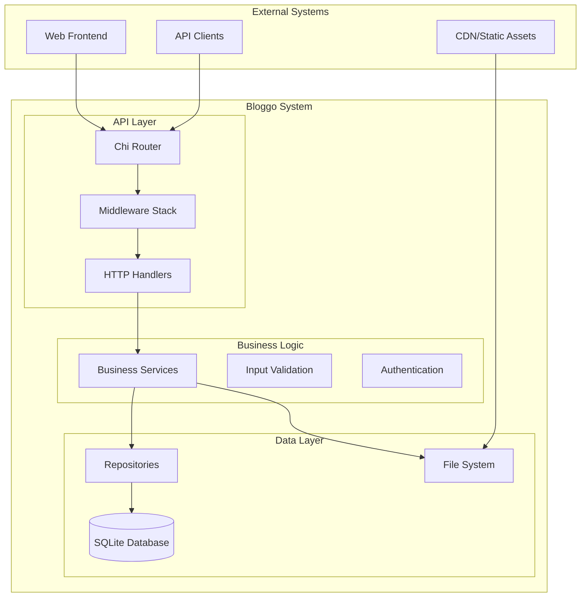
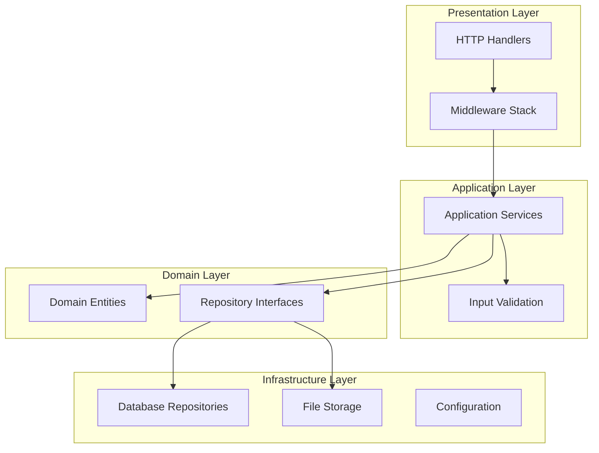
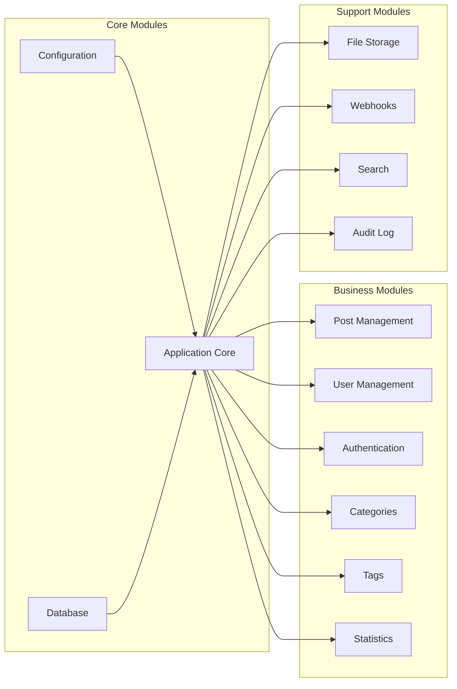
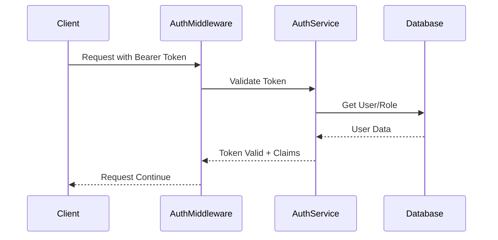
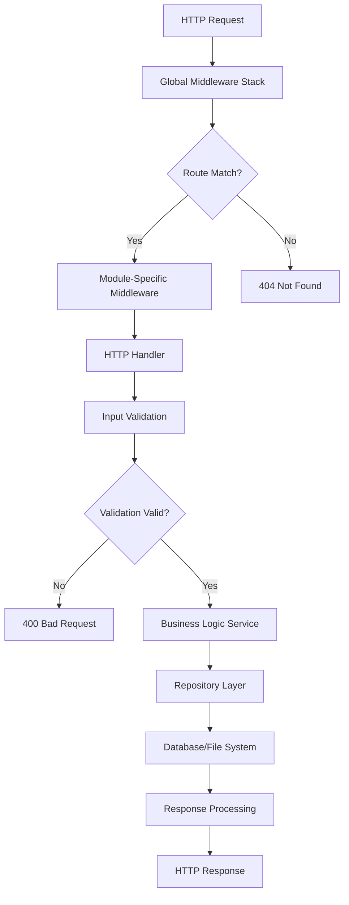
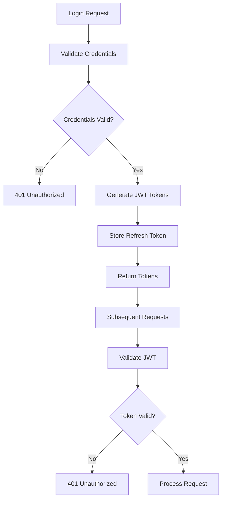

# Bloggo Architecture Overview

## 📋 Table of Contents
- [System Overview](#system-overview)
- [High-Level Architecture](#high-level-architecture)
- [Core Components](#core-components)
- [Data Flow](#data-flow)
- [Technology Stack](#technology-stack)
- [Design Principles](#design-principles)
- [Architecture Decisions](#architecture-decisions)

## 🌐 System Overview

Bloggo is a modern, feature-rich blog management system built with Go. It provides a complete content management solution with post versioning, role-based permissions, statistics tracking, and comprehensive analytics.

### Key Characteristics
- **Monolithic Architecture**: Single deployable unit with modular internal structure
- **REST API**: HTTP-based API with JSON communication
- **SQLite Database**: Lightweight, embedded database for data persistence
- **File System Storage**: Local file system for media and uploads
- **Role-Based Access Control**: Granular permission system

### System Boundaries


## 🏗️ High-Level Architecture

### Layered Architecture Pattern



### Module Structure

Bloggo follows a modular architecture where each feature is implemented as a self-contained module:



## 🔧 Core Components

### 1. Application Core (`internal/app/`)

**Purpose**: Central application bootstrap and lifecycle management

**Key Components**:
- **Application Singleton**: Ensures single instance across the application
- **Router Configuration**: Sets up HTTP routing with Chi
- **Module Registration**: Registers and initializes all feature modules
- **Middleware Setup**: Configures global middleware stack

**Key Code**:
```go
type Application struct {
    Router *chi.Mux
}

func Get() *Application {
    once.Do(func() {
        databaseConnection := db.Get()
        permissionStore := permissions.Get()
        permissionStore.Load(databaseConnection)
        audit.InitializeAuditLogger(databaseConnection)

        instance = Application{
            Router: chi.NewRouter(),
        }
    })
    return &instance
}
```

### 2. Configuration Management (`internal/config/`)

**Purpose**: Centralized configuration with validation and defaults

**Key Features**:
- JSON-based configuration files
- Environment variable support
- Automatic config generation
- Input validation with custom validators
- Runtime configuration access

**Configuration Structure**:
```go
type Config struct {
    Port                 int    `json:"port" validate:"required,port"`
    JWTSecret            string `json:"JWTSecret" validate:"required,min=32,max=32"`
    AccessTokenDuration  int    `json:"accessTokenDuration" validate:"required"`
    RefreshTokenDuration int    `json:"refreshTokenDuration" validate:"required"`
    GeminiAPIKey         string `json:"geminiApiKey"`
    TrustedFrontendKey   string `json:"trustedFrontendKey" validate:"required,min=32,max=32"`
}
```

### 3. Database Layer (`internal/db/`)

**Purpose**: Database connection management and schema initialization

**Key Components**:
- **Connection Pooling**: Singleton database connection
- **Schema Management**: Automatic table creation and migration
- **Seeding**: Default data population
- **Query Management**: Centralized query definitions

**Database Initialization**:
```go
func Get() *sql.DB {
    once.Do(func() {
        var err error
        db, err = sql.Open("sqlite3", "bloggo.sqlite")
        if err != nil {
            log.Fatal("Cannot open the database.")
        }
        InitializeTables(db)
        SeedDatabase(db)
    })
    return db
}
```

### 4. Authentication & Authorization

**Purpose**: Secure user authentication and role-based authorization

**Key Components**:
- **JWT Tokens**: Stateless authentication with access/refresh tokens
- **Role-Based Access Control**: Hierarchical permission system
- **Middleware Integration**: Seamless authentication checks
- **Session Management**: Token refresh and validation

**Auth Flow**:


## 📊 Data Flow

### Request Processing Flow



### Authentication Flow



## 🛠️ Technology Stack

### Core Technologies

| Component | Technology | Version | Purpose |
|-----------|------------|---------|---------|
| **Language** | Go | 1.24.3 | Primary programming language |
| **Web Framework** | Chi | v1.5.5 | HTTP routing and middleware |
| **Database** | SQLite3 | v1.14.28 | Data persistence |
| **Authentication** | JWT | v5.2.3 | Stateless authentication |
| **Validation** | Validator | v10.27.0 | Input validation |
| **Image Processing** | WebP | v1.4.0 | Image optimization |

### Supporting Libraries

| Library | Purpose | Key Features |
|---------|---------|--------------|
| **UUID** | Unique identifier generation | v1.6.0 |
| **Crypto** | Cryptographic operations | v0.33.0 |
| **Time Rate** | Rate limiting | v0.12.0 |
| **Resize** | Image resizing | v0.0.0-20180221191011 |
| **Mimetype** | Content type detection | v1.4.8 |

## 🎯 Design Principles

### 1. Single Responsibility Principle
Each module, package, and function has a single, well-defined responsibility.

**Example**:
- `internal/module/post` handles only post-related operations
- `internal/middleware/auth` handles only authentication
- `internal/config` handles only configuration management

### 2. Dependency Inversion
High-level modules depend on abstractions, not concretions.

**Implementation**:
```go
type PostRepository interface {
    Create(post *Post) error
    GetByID(id int64) (*Post, error)
    Update(post *Post) error
    Delete(id int64) error
}

type PostService struct {
    repo PostRepository
}
```

### 3. Don't Repeat Yourself (DRY)
Common functionality is abstracted into reusable components.

**Examples**:
- Common error handling utilities
- Shared validation logic
- Reusable middleware components

### 4. Fail Fast
Errors are detected and reported as early as possible.

**Implementation**:
- Configuration validation on startup
- Input validation at API boundaries
- Database constraint validation

### 5. Security by Default
Security features are enabled by default and must be explicitly disabled.

**Features**:
- All endpoints require authentication by default
- Input validation is mandatory
- Rate limiting is enabled globally

## 🤔 Architecture Decisions

### 1. Monolithic Architecture

**Decision**: Single deployable unit with modular internal structure

**Rationale**:
- Simplicity: Easier to develop, test, and deploy
- Performance: No network overhead between services
- Resource Efficiency: Lower resource requirements
- Operational Simplicity: Single process to monitor

**Trade-offs**:
- Scalability: Horizontal scaling is more complex
- Technology Diversity: Limited to Go/SQLite stack
- Team Scaling: Larger teams may conflict

### 2. SQLite Database

**Decision**: Use SQLite as the primary database

**Rationale**:
- Simplicity: No external database server required
- Portability: Single file database
- Performance: Excellent for read-heavy workloads
- Reliability: ACID compliant with minimal setup

**Trade-offs**:
- Concurrency: Limited write concurrency
- Scaling: Not suitable for massive scale
- Network Access: No remote access capabilities

### 3. JWT Authentication

**Decision**: Stateless JWT-based authentication

**Rationale**:
- Scalability: No server-side session storage
- Performance: Fast token validation
- Flexibility: Works across multiple services
- Security: Cryptographic signing

**Trade-offs**:
- Token Size: Larger than session IDs
- Revocation: Token revocation is complex
- Storage: Client-side token storage

### 4. File System Storage

**Decision**: Use local file system for media storage

**Rationale**:
- Simplicity: No external storage services
- Performance: Direct file system access
- Cost: No additional storage costs
- Control: Full control over storage

**Trade-offs**:
- Scalability: Limited to single server storage
- Backup: Manual backup requirements
- Redundancy: No built-in redundancy

### 5. Chi Router

**Decision**: Use Chi as the HTTP router

**Rationale**:
- Performance: High-performance routing
- Compatibility: Standard library compatible
- Middleware: Rich middleware ecosystem
- Simplicity: Clean and intuitive API

**Trade-offs**:
- Features: Fewer features than some alternatives
- Community: Smaller community than Gin/Echo

## 🔄 Future Architecture Evolution

### Potential Improvements

1. **Microservices Migration**
   - Gradual extraction of services
   - API gateway implementation
   - Service mesh adoption

2. **Database Scaling**
   - PostgreSQL migration
   - Read replica implementation
   - Connection pooling optimization

3. **Storage Evolution**
   - Object storage integration (S3, GCS)
   - CDN implementation
   - Image optimization pipeline

4. **Caching Layer**
   - Redis integration
   - Application-level caching
   - Database query caching

5. **Event-Driven Architecture**
   - Message queue implementation
   - Event sourcing patterns
   - Asynchronous processing

### Migration Strategy

1. **Phase 1**: Horizontal scaling preparation
2. **Phase 2**: Service boundary identification
3. **Phase 3**: Gradual service extraction
4. **Phase 4**: Full microservices adoption

---

**Document Version**: 1.0.0
**Last Updated**: October 4, 2025
**Author**: Bloggo Development Team
**Reviewers**: Architecture Committee