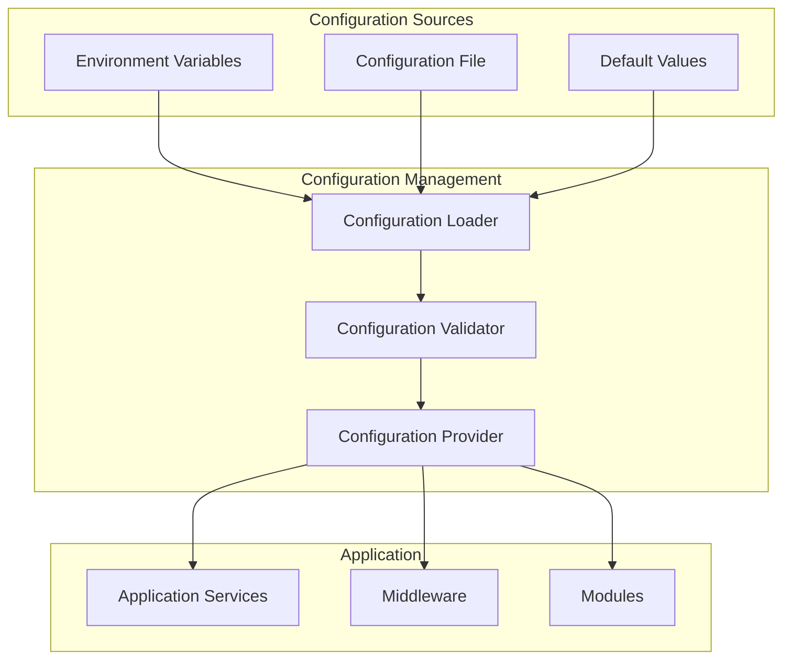

# Configuration Management

## 📋 Table of Contents
- [Configuration Overview](#configuration-overview)
- [Environment Variables](#environment-variables)
- [Configuration File](#configuration-file)
- [Security Configuration](#security-configuration)
- [Database Configuration](#database-configuration)
- [Performance Configuration](#performance-configuration)
- [Logging Configuration](#logging-configuration)
- [Feature Flags](#feature-flags)
- [Configuration Validation](#configuration-validation)
- [Best Practices](#best-practices)

## 🎯 Configuration Overview

Bloggo uses a hierarchical configuration system that allows settings to be specified in multiple ways, with a clear precedence order:

### Configuration Precedence (Highest to Lowest)

1. **Environment Variables** - Override all other settings
2. **Configuration File** - `bloggo-config.json`
3. **Default Values** - Built-in safe defaults

### Configuration Architecture



## 🌍 Environment Variables

### Server Configuration

| Variable | Type | Default | Description |
|----------|------|---------|-------------|
| `BLOGGO_PORT` | integer | 8723 | Server port |
| `BLOGGO_HOST` | string | "0.0.0.0" | Server host |
| `BLOGGO_ENV` | string | "development" | Environment (development/production) |

### Security Configuration

| Variable | Type | Default | Description |
|----------|------|---------|-------------|
| `BLOGGO_JWT_SECRET` | string | generated | JWT signing secret (32 chars) |
| `BLOGGO_ACCESS_TOKEN_DURATION` | integer | 900 | Access token lifetime in seconds |
| `BLOGGO_REFRESH_TOKEN_DURATION` | integer | 604800 | Refresh token lifetime in seconds |
| `BLOGGO_TRUSTED_FRONTEND_KEY` | string | generated | Frontend authentication key (32 chars) |

### Database Configuration

| Variable | Type | Default | Description |
|----------|------|---------|-------------|
| `BLOGGO_DB_PATH` | string | "bloggo.sqlite" | Database file path |
| `BLOGGO_DB_MAX_CONNECTIONS` | integer | 1 | Maximum database connections |
| `BLOGGO_DB_CONNECTION_TIMEOUT` | integer | 30 | Connection timeout in seconds |

### File Storage Configuration

| Variable | Type | Default | Description |
|----------|------|---------|-------------|
| `BLOGGO_UPLOADS_PATH` | string | "uploads" | Upload directory path |
| `BLOGGO_MAX_FILE_SIZE` | integer | 10485760 | Maximum file size in bytes (10MB) |
| `BLOGGO_ALLOWED_FILE_TYPES` | string | "jpg,jpeg,png,gif,webp,pdf,doc,docx" | Allowed file extensions |

### Performance Configuration

| Variable | Type | Default | Description |
|----------|------|---------|-------------|
| `BLOGGO_RATE_LIMIT_REQUESTS` | integer | 100 | Rate limit requests per minute |
| `BLOGGO_RATE_LIMIT_WINDOW` | integer | 60 | Rate limit window in seconds |
| `BLOGGO_CACHE_TTL` | integer | 300 | Cache TTL in seconds |

### Logging Configuration

| Variable | Type | Default | Description |
|----------|------|---------|-------------|
| `BLOGGO_LOG_LEVEL` | string | "info" | Log level (debug, info, warn, error) |
| `BLOGGO_LOG_FORMAT` | string | "json" | Log format (json, text) |
| `BLOGGO_LOG_FILE` | string | "" | Log file path (empty = stdout) |

### External Services Configuration

| Variable | Type | Default | Description |
|----------|------|---------|-------------|
| `BLOGGO_GEMINI_API_KEY` | string | "" | Google Gemini API key |
| `BLOGGO_WEBHOOK_TIMEOUT` | integer | 30 | Webhook timeout in seconds |
| `BLOGGO_WEBHOOK_RETRY_ATTEMPTS` | integer | 3 | Maximum webhook retry attempts |

### Example Environment Setup

```bash
# Linux/macOS
export BLOGGO_PORT=8080
export BLOGGO_ENV=production
export BLOGGO_JWT_SECRET="your-32-character-secret-key"
export BLOGGO_ACCESS_TOKEN_DURATION=1800
export BLOGGO_DB_PATH="/var/lib/bloggo/bloggo.sqlite"
export BLOGGO_UPLOADS_PATH="/var/lib/bloggo/uploads"
export BLOGGO_LOG_LEVEL="warn"
export BLOGGO_GEMINI_API_KEY="your-gemini-api-key"

# Windows
set BLOGGO_PORT=8080
set BLOGGO_ENV=production
set BLOGGO_JWT_SECRET=your-32-character-secret-key
set BLOGGO_ACCESS_TOKEN_DURATION=1800
set BLOGGO_DB_PATH=C:\bloggo\bloggo.sqlite
set BLOGGO_UPLOADS_PATH=C:\bloggo\uploads
set BLOGGO_LOG_LEVEL=warn
set BLOGGO_GEMINI_API_KEY=your-gemini-api-key
```

## 📄 Configuration File

### Default Configuration File Structure

```json
{
  "port": 8723,
  "host": "0.0.0.0",
  "environment": "development",
  "JWTSecret": "generated-32-character-secret",
  "accessTokenDuration": 900,
  "refreshTokenDuration": 604800,
  "trustedFrontendKey": "generated-32-character-key",
  "database": {
    "path": "bloggo.sqlite",
    "maxConnections": 1,
    "connectionTimeout": 30
  },
  "storage": {
    "uploadsPath": "uploads",
    "maxFileSize": 10485760,
    "allowedFileTypes": ["jpg", "jpeg", "png", "gif", "webp", "pdf", "doc", "docx"]
  },
  "performance": {
    "rateLimitRequests": 100,
    "rateLimitWindow": 60,
    "cacheTTL": 300
  },
  "logging": {
    "level": "info",
    "format": "json",
    "file": ""
  },
  "externalServices": {
    "geminiApiKey": "",
    "webhookTimeout": 30,
    "webhookRetryAttempts": 3
  },
  "features": {
    "aiEnabled": false,
    "webhooksEnabled": true,
    "auditLogEnabled": true,
    "statisticsEnabled": true
  }
}
```

### Configuration File Generation

The application automatically generates a configuration file on first run:

```go
// Configuration generation function
func generateConfig() *Config {
    secret, err := cryptography.GenerateRandomHS256Secret()
    if err != nil {
        log.Fatal("Couldn't generate secret key.")
    }

    trustedFrontendKey, err := cryptography.GenerateRandomHS256Secret()
    if err != nil {
        log.Fatal("Couldn't generate trusted frontend key.")
    }

    return &Config{
        Port:                 8723,
        JWTSecret:            secret,
        AccessTokenDuration:  60 * 15,            // 15 minutes
        RefreshTokenDuration: 60 * 60 * 24 * 7,   // 7 days
        GeminiAPIKey:         "",
        TrustedFrontendKey:   trustedFrontendKey,
    }
}
```

### Configuration File Loading

```go
func load(file string) Config {
    // Check if config file exists
    if _, err := os.Stat(file); os.IsNotExist(err) {
        generateConfig().Save(file)
    }

    // Read and parse configuration
    content, err := os.ReadFile(file)
    if err != nil {
        log.Fatal(err)
    }

    result := Config{}
    if err := json.Unmarshal(content, &result); err != nil {
        log.Fatal("Error while parsing configuration.")
    }

    // Validate configuration
    err = validate.GetValidator().Struct(result)
    if err != nil {
        fmt.Println(err)
        log.Fatal("Configuration loaded but is not valid.")
    }

    return result
}
```

## 🔒 Security Configuration

### Security Best Practices

1. **Use Strong Secrets**:
   ```json
   {
     "JWTSecret": "minimum-32-characters-random-string",
     "trustedFrontendKey": "another-32-character-random-string"
   }
   ```

2. **Environment-Specific Configuration**:
   ```json
   {
     "environment": "production",
     "port": 443,
     "accessTokenDuration": 900,
     "refreshTokenDuration": 604800
   }
   ```

3. **File Security**:
   ```json
   {
     "storage": {
       "maxFileSize": 5242880,
       "allowedFileTypes": ["jpg", "jpeg", "png", "gif", "webp"]
     }
   }
   ```

### Security Headers Configuration

```go
// Security middleware configuration
type SecurityConfig struct {
    EnableCSRF      bool `json:"enableCSRF"`
    EnableHSTS      bool `json:"enableHSTS"`
    EnableCSP       bool `json:"enableCSP"`
    TrustedOrigins  []string `json:"trustedOrigins"`
}

// Default security configuration
SecurityConfig{
    EnableCSRF:     true,
    EnableHSTS:     true,
    EnableCSP:      true,
    TrustedOrigins: []string{"https://yourdomain.com"},
}
```

### CORS Configuration

```json
{
  "cors": {
    "allowedOrigins": ["https://yourdomain.com"],
    "allowedMethods": ["GET", "POST", "PUT", "DELETE"],
    "allowedHeaders": ["Content-Type", "Authorization"],
    "maxAge": 86400,
    "credentials": true
  }
}
```

## 🗄️ Database Configuration

### SQLite Configuration

```json
{
  "database": {
    "path": "bloggo.sqlite",
    "maxConnections": 1,
    "connectionTimeout": 30,
    "walMode": true,
    "cacheSize": 10000,
    "tempStore": "memory"
  }
}
```

### Database Performance Settings

```go
// SQLite pragmas for performance
func configureDatabase(db *sql.DB) error {
    pragmas := []string{
        "PRAGMA journal_mode = WAL",
        "PRAGMA synchronous = NORMAL",
        "PRAGMA cache_size = -10000",
        "PRAGMA temp_store = MEMORY",
        "PRAGMA mmap_size = 268435456",
    }

    for _, pragma := range pragmas {
        if _, err := db.Exec(pragma); err != nil {
            return fmt.Errorf("failed to execute pragma %s: %w", pragma, err)
        }
    }

    return nil
}
```

### Database Backup Configuration

```json
{
  "database": {
    "backup": {
      "enabled": true,
      "interval": "24h",
      "retention": 30,
      "path": "backups/"
    }
  }
}
```

## ⚡ Performance Configuration

### Rate Limiting Configuration

```json
{
  "performance": {
    "rateLimiting": {
      "global": {
        "requests": 100,
        "window": 60
      },
      "endpoints": {
        "login": {
          "requests": 5,
          "window": 300
        },
        "upload": {
          "requests": 10,
          "window": 60
        }
      }
    }
  }
}
```

### Caching Configuration

```json
{
  "performance": {
    "cache": {
      "enabled": true,
      "ttl": 300,
      "maxSize": 1000,
      "provider": "memory"
    }
  }
}
```

### Memory Configuration

```json
{
  "performance": {
    "memory": {
      "maxGoroutines": 1000,
      "gcPercent": 100,
      "maxMemory": "1GB"
    }
  }
}
```

## 📝 Logging Configuration

### Log Levels and Formats

```json
{
  "logging": {
    "level": "info",
    "format": "json",
    "file": "",
    "maxSize": "100MB",
    "maxBackups": 3,
    "maxAge": 30,
    "compress": true
  }
}
```

### Structured Logging

```go
// Log entry structure
type LogEntry struct {
    Level     string                 `json:"level"`
    Timestamp time.Time             `json:"timestamp"`
    Message   string                 `json:"message"`
    Fields    map[string]interface{} `json:"fields,omitempty"`
    RequestID string                 `json:"requestId,omitempty"`
    UserID    string                 `json:"userId,omitempty"`
}

// Example log entry
{
  "level": "info",
  "timestamp": "2025-10-04T12:00:00Z",
  "message": "Post created successfully",
  "fields": {
    "postId": 123,
    "title": "New Post"
  },
  "requestId": "req_123456789",
  "userId": "user_456"
}
```

### Audit Logging Configuration

```json
{
  "logging": {
    "audit": {
      "enabled": true,
      "level": "info",
      "includeRequestBody": false,
      "includeResponseBody": false,
      "retention": 90
    }
  }
}
```

## 🚦 Feature Flags

### Feature Toggle Configuration

```json
{
  "features": {
    "aiEnabled": false,
    "webhooksEnabled": true,
    "auditLogEnabled": true,
    "statisticsEnabled": true,
    "searchEnabled": true,
    "apiDocsEnabled": true,
    "publicAPIEnabled": true
  }
}
```

### Dynamic Feature Flags

```go
// Feature flag service
type FeatureFlagService struct {
    flags map[string]bool
    mu    sync.RWMutex
}

func (ffs *FeatureFlagService) IsEnabled(feature string) bool {
    ffs.mu.RLock()
    defer ffs.mu.RUnlock()
    return ffs.flags[feature]
}

func (ffs *FeatureFlagService) SetFeature(feature string, enabled bool) {
    ffs.mu.Lock()
    defer ffs.mu.Unlock()
    ffs.flags[feature] = enabled
}
```

### Environment-Specific Features

```json
{
  "environments": {
    "development": {
      "features": {
        "debugMode": true,
        "apiDocsEnabled": true,
        "mockExternalServices": true
      }
    },
    "staging": {
      "features": {
        "debugMode": false,
        "apiDocsEnabled": true,
        "mockExternalServices": false
      }
    },
    "production": {
      "features": {
        "debugMode": false,
        "apiDocsEnabled": false,
        "mockExternalServices": false
      }
    }
  }
}
```

## ✅ Configuration Validation

### Validation Rules

```go
// Configuration validation
type Config struct {
    Port                 int    `json:"port" validate:"required,min=1,max=65535"`
    JWTSecret            string `json:"JWTSecret" validate:"required,min=32,max=32"`
    AccessTokenDuration  int    `json:"accessTokenDuration" validate:"required,min=60"`
    RefreshTokenDuration int    `json:"refreshTokenDuration" validate:"required,min=60"`
    TrustedFrontendKey   string `json:"trustedFrontendKey" validate:"required,min=32,max=32"`
}

func (c *Config) Validate() error {
    validator := validate.GetValidator()
    return validator.Struct(c)
}
```

### Custom Validation Functions

```go
// Custom validator for JWT secret
func validateJWTSecret(fl validator.FieldLevel) bool {
    secret := fl.Field().String()

    // Check length
    if len(secret) != 32 {
        return false
    }

    // Check for randomness (basic entropy check)
    hasUpper := regexp.MustCompile(`[A-Z]`).MatchString(secret)
    hasLower := regexp.MustCompile(`[a-z]`).MatchString(secret)
    hasNumber := regexp.MustCompile(`[0-9]`).MatchString(secret)

    return hasUpper && hasLower && hasNumber
}

// Register custom validator
func RegisterCustomValidators(v *validator.Validate) {
    v.RegisterValidation("jwt_secret", validateJWTSecret)
}
```

### Configuration Health Check

```go
// Configuration health check
func CheckConfigurationHealth(config *Config) error {
    // Check database accessibility
    if _, err := os.Stat(config.Database.Path); os.IsNotExist(err) {
        return fmt.Errorf("database file does not exist: %s", config.Database.Path)
    }

    // Check upload directory
    if _, err := os.Stat(config.Storage.UploadsPath); os.IsNotExist(err) {
        if err := os.MkdirAll(config.Storage.UploadsPath, 0755); err != nil {
            return fmt.Errorf("cannot create upload directory: %w", err)
        }
    }

    // Check JWT secret strength
    if len(config.JWTSecret) < 32 {
        return fmt.Errorf("JWT secret must be at least 32 characters")
    }

    return nil
}
```

## 🎯 Best Practices

### 1. Environment Separation

Use different configurations for different environments:

```json
// Development configuration
{
  "environment": "development",
  "port": 8080,
  "logging": {
    "level": "debug",
    "format": "text"
  },
  "features": {
    "debugMode": true
  }
}

// Production configuration
{
  "environment": "production",
  "port": 443,
  "logging": {
    "level": "warn",
    "format": "json"
  },
  "features": {
    "debugMode": false
  }
}
```

### 2. Secret Management

Never store secrets in configuration files:

```bash
# Use environment variables for secrets
export BLOGGO_JWT_SECRET=$(openssl rand -base64 32)
export BLOGGO_TRUSTED_FRONTEND_KEY=$(openssl rand -base64 32)
```

### 3. Configuration Validation

Always validate configuration on startup:

```go
func main() {
    config := config.Get()

    if err := config.Validate(); err != nil {
        log.Fatalf("Invalid configuration: %v", err)
    }

    if err := CheckConfigurationHealth(&config); err != nil {
        log.Fatalf("Configuration health check failed: %v", err)
    }

    application := app.Get()
    application.Bootstrap()
}
```

### 4. Configuration Documentation

Document all configuration options:

```json
{
  "_comment": "Bloggo Configuration File",
  "_documentation": {
    "port": "Server port (1-65535)",
    "JWTSecret": "JWT signing secret (must be 32 characters)",
    "accessTokenDuration": "Access token lifetime in seconds (minimum 60)",
    "refreshTokenDuration": "Refresh token lifetime in seconds (minimum 60)"
  }
}
```

### 5. Configuration Monitoring

Monitor configuration changes and health:

```go
// Configuration monitoring
func MonitorConfiguration(config *Config) {
    ticker := time.NewTicker(5 * time.Minute)

    for range ticker.C {
        if err := CheckConfigurationHealth(config); err != nil {
            log.Printf("Configuration health check failed: %v", err)
        }
    }
}
```

### 6. Backup and Recovery

Keep configuration files under version control and maintain backups:

```bash
# Backup configuration
cp bloggo-config.json backups/bloggo-config-$(date +%Y%m%d).json

# Track configuration changes
git add bloggo-config.json
git commit -m "Update configuration"
```

---

**Document Version**: 1.0.0
**Last Updated**: October 4, 2025
**Author**: Bloggo Development Team
**Reviewers**: Configuration Management Committee